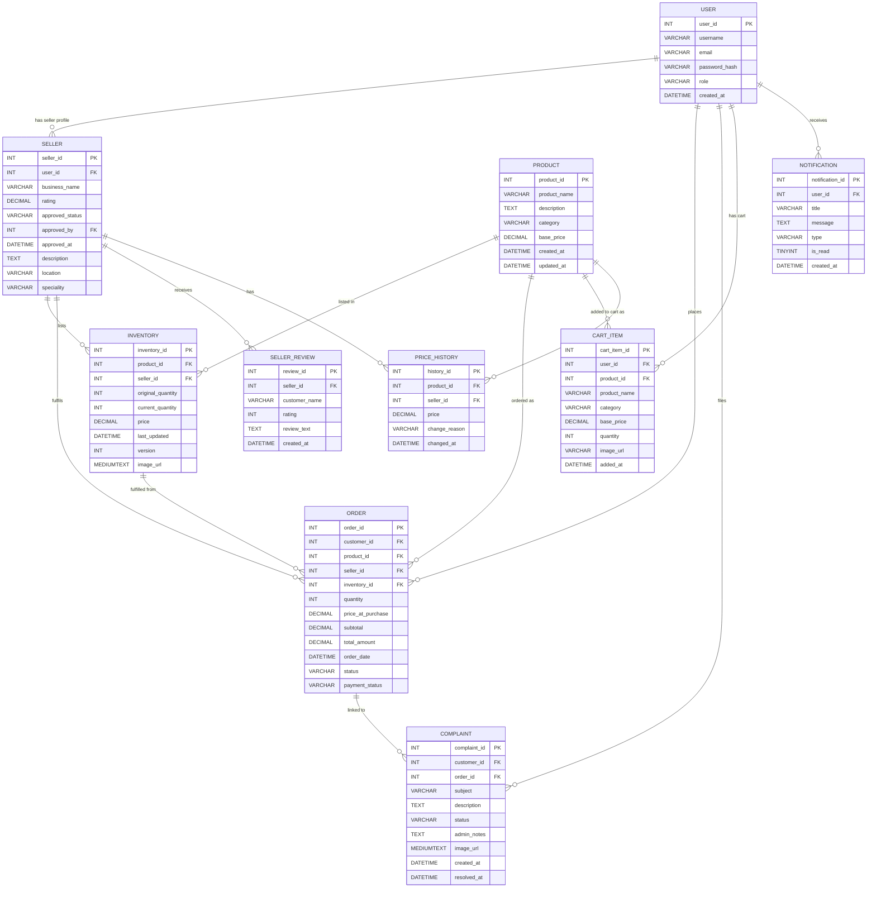

# ShopEasy — Entity Relationship Diagram

## ER Diagram (Mermaid)

> Renders in GitHub, VS Code with Markdown Preview, and Mermaid Live Editor (mermaid.live)

---

## Table Structures

### USER
Stores all platform users — customers, sellers, and admins.

| Column | Type | Constraints | Description |
|---|---|---|---|
| user_id | INT | PK, AUTO_INCREMENT | Unique user identifier |
| username | VARCHAR(50) | NOT NULL | Display name |
| email | VARCHAR(100) | NOT NULL | Login email (unique constraint removed to allow multi-seller testing) |
| password_hash | VARCHAR(255) | NOT NULL | Stored as `hashed_<password>` |
| role | VARCHAR(20) | NOT NULL | `customer`, `seller`, or `admin` |
| created_at | DATETIME | | Account creation timestamp |

**Relationships:** One user can have one seller profile, many orders, many complaints, many cart items, many notifications.

---

### SELLER
Extended profile for users with role = `seller`.

| Column | Type | Constraints | Description |
|---|---|---|---|
| seller_id | INT | PK, AUTO_INCREMENT | Unique seller identifier |
| user_id | INT | FK → USER.user_id | Links to the user account |
| business_name | VARCHAR(100) | NOT NULL | Store display name |
| rating | DECIMAL(3,2) | | Average rating (0.00–5.00), recalculated from complaints |
| approved_status | VARCHAR(20) | NOT NULL | `pending` or `approved` |
| approved_by | INT | FK → USER.user_id | Admin who approved |
| approved_at | DATETIME | | Approval timestamp |
| description | TEXT | | Store description (set during registration or profile edit) |
| location | VARCHAR(100) | | City, State |
| speciality | VARCHAR(100) | | Primary product category |

**Relationships:** One seller has many inventory listings, many orders, many reviews, many price history records.

---

### PRODUCT
The master product catalogue managed by admins.

| Column | Type | Constraints | Description |
|---|---|---|---|
| product_id | INT | PK, AUTO_INCREMENT | Unique product identifier |
| product_name | VARCHAR(100) | NOT NULL | Product display name |
| description | TEXT | | Full product description |
| category | VARCHAR(50) | | Electronics, Footwear, Kitchen, Sports, Books, Home Decor, Toys, etc. |
| base_price | DECIMAL(10,2) | NOT NULL | Reference price set by admin |
| created_at | DATETIME | | When product was added |
| updated_at | DATETIME | | Last modification timestamp |

**Relationships:** One product can be listed by many sellers (via INVENTORY), appear in many orders, and have many price history records.

---

### INVENTORY
Junction table linking sellers to products with their own price and stock.

| Column | Type | Constraints | Description |
|---|---|---|---|
| inventory_id | INT | PK, AUTO_INCREMENT | Unique listing identifier |
| product_id | INT | FK → PRODUCT.product_id | Which product |
| seller_id | INT | FK → SELLER.seller_id | Which seller |
| original_quantity | INT | NOT NULL | Stock when first listed |
| current_quantity | INT | NOT NULL | Current available stock |
| price | DECIMAL(10,2) | NOT NULL | Seller's own selling price |
| last_updated | DATETIME | | Last stock/price update |
| version | INT | NOT NULL | Optimistic locking version counter |
| image_url | MEDIUMTEXT | | Seller-uploaded product image (base64 or URL) |

**Key constraint:** `(product_id, seller_id)` should be unique — one seller lists each product once.

**Relationships:** Each inventory row belongs to one seller and one product. Orders are fulfilled from a specific inventory row.

---

### ORDER
Records every purchase made on the platform.

| Column | Type | Constraints | Description |
|---|---|---|---|
| order_id | INT | PK, AUTO_INCREMENT | Unique order identifier |
| customer_id | INT | FK → USER.user_id | Who placed the order |
| product_id | INT | FK → PRODUCT.product_id | What was ordered |
| seller_id | INT | FK → SELLER.seller_id | Who fulfilled it |
| inventory_id | INT | FK → INVENTORY.inventory_id | Which inventory row was decremented |
| quantity | INT | NOT NULL | Units ordered |
| price_at_purchase | DECIMAL(10,2) | NOT NULL | Seller's price at time of order |
| subtotal | DECIMAL(10,2) | NOT NULL | price × quantity |
| total_amount | DECIMAL(10,2) | NOT NULL | Final amount charged |
| order_date | DATETIME | | When order was placed |
| status | VARCHAR(20) | NOT NULL | `processing`, `shipped`, `delivered`, `cancelled` |
| payment_status | VARCHAR(20) | NOT NULL | `paid`, `pending`, `refunded` |

**Relationships:** Each order links one customer, one product, one seller, and one inventory row. Orders can have complaints filed against them.

---

### COMPLAINT
Customer complaints linked to specific orders.

| Column | Type | Constraints | Description |
|---|---|---|---|
| complaint_id | INT | PK, AUTO_INCREMENT | Unique complaint identifier |
| customer_id | INT | FK → USER.user_id | Who filed the complaint |
| order_id | INT | FK → ORDER.order_id, nullable | Related order (0 if no order) |
| subject | VARCHAR(200) | NOT NULL | Brief complaint title |
| description | TEXT | | Full complaint details |
| status | VARCHAR(20) | NOT NULL | `open`, `in_progress`, `resolved` |
| admin_notes | TEXT | | Admin response/resolution notes |
| image_url | MEDIUMTEXT | | Attached image (base64 encoded) |
| created_at | DATETIME | | When complaint was filed |
| resolved_at | DATETIME | | When complaint was resolved |

**Relationships:** Each complaint belongs to one customer and optionally one order. Complaints affect the seller's rating (unresolved complaints reduce rating by 0.2 each).

---

### CART_ITEM
Persistent shopping cart — survives logout and works across devices.

| Column | Type | Constraints | Description |
|---|---|---|---|
| cart_item_id | INT | PK, AUTO_INCREMENT | Unique cart item identifier |
| user_id | INT | FK → USER.user_id | Cart owner |
| product_id | INT | FK → PRODUCT.product_id | Product in cart |
| product_name | VARCHAR(100) | NOT NULL | Denormalised for display without joins |
| category | VARCHAR(50) | | Product category |
| base_price | DECIMAL(10,2) | NOT NULL | Price at time of adding to cart |
| quantity | INT | NOT NULL, DEFAULT 1 | How many units |
| image_url | VARCHAR(500) | | Product image URL |
| added_at | DATETIME | | When item was added |

**Key constraint:** `UNIQUE(user_id, product_id)` — one row per product per user. Adding the same product increments quantity.

**Relationships:** Each cart item belongs to one user and references one product.

---

### NOTIFICATION
In-app notifications for sellers (approval, rejection, info).

| Column | Type | Constraints | Description |
|---|---|---|---|
| notification_id | INT | PK, AUTO_INCREMENT | Unique notification identifier |
| user_id | INT | FK → USER.user_id | Recipient |
| title | VARCHAR(200) | NOT NULL | Short notification heading |
| message | TEXT | | Full notification body |
| type | VARCHAR(50) | DEFAULT 'info' | `approval`, `rejection`, `info` |
| is_read | TINYINT(1) | NOT NULL, DEFAULT 0 | 0 = unread, 1 = read |
| created_at | DATETIME | | When notification was created |

**Relationships:** Each notification belongs to one user. Created automatically when admin approves/rejects a seller.

---

### SELLER_REVIEW
Customer reviews for seller storefronts.

| Column | Type | Constraints | Description |
|---|---|---|---|
| review_id | INT | PK, AUTO_INCREMENT | Unique review identifier |
| seller_id | INT | FK → SELLER.seller_id | Which seller is reviewed |
| customer_name | VARCHAR(60) | NOT NULL | Reviewer display name |
| rating | INT | NOT NULL | 1–5 star rating |
| review_text | TEXT | NOT NULL | Review content |
| created_at | DATETIME | DEFAULT NOW() | When review was written |

**Relationships:** Each review belongs to one seller. Displayed on the public seller store page with a rating breakdown chart.

---

### PRICE_HISTORY
Audit log of every price change per seller-product pair.

| Column | Type | Constraints | Description |
|---|---|---|---|
| history_id | INT | PK, AUTO_INCREMENT | Unique record identifier |
| product_id | INT | FK → PRODUCT.product_id | Which product |
| seller_id | INT | FK → SELLER.seller_id | Which seller |
| price | DECIMAL(10,2) | NOT NULL | Price at this point in time |
| change_reason | VARCHAR(255) | | Why the price changed |
| changed_at | DATETIME | | When the change occurred |

**Relationships:** Each record links one product and one seller. Written automatically when a seller updates their price or lists a new product.

---

## Relationship Summary

| Relationship | Type | Description |
|---|---|---|
| USER → SELLER | 1:1 | One user account can have one seller profile |
| USER → ORDER | 1:N | One customer can place many orders |
| USER → COMPLAINT | 1:N | One customer can file many complaints |
| USER → CART_ITEM | 1:N | One user has many cart items |
| USER → NOTIFICATION | 1:N | One user receives many notifications |
| SELLER → INVENTORY | 1:N | One seller lists many products |
| SELLER → ORDER | 1:N | One seller fulfils many orders |
| SELLER → SELLER_REVIEW | 1:N | One seller has many reviews |
| SELLER → PRICE_HISTORY | 1:N | One seller has many price records |
| PRODUCT → INVENTORY | 1:N | One product listed by many sellers |
| PRODUCT → ORDER | 1:N | One product in many orders |
| PRODUCT → PRICE_HISTORY | 1:N | One product has many price records |
| INVENTORY → ORDER | 1:N | One inventory row fulfils many orders |
| ORDER → COMPLAINT | 1:N | One order can have multiple complaints |
